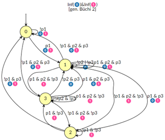
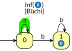
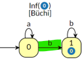
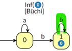
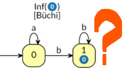

# LBTT Testing
This is an application of some ideas I had in the past about formal validation of how software systems are allowed to 
evolve their state over time. Static invariants are commonly used to model immutable properties of software, but there
are no widespread mechanisms (in wide use) to specify time-variant behavior of systems, and even to validate their
behavior at run-time. For more reading material on my earlier explorations, you can read 
[Constraints on workflow paths](https://dsouflis.wordpress.com/2013/04/26/constraints-on-workflow-paths/), 
[its part 2](https://dsouflis.wordpress.com/2013/04/29/constraints-on-workflow-paths-part-2/) and 
[New table constraint planned for Pandamaror, part 1](https://dsouflis.wordpress.com/2013/04/26/constraints-on-workflow-paths/),
[part 2](https://dsouflis.wordpress.com/2013/04/29/constraints-on-workflow-paths-part-2/) and
[part 3](https://dsouflis.wordpress.com/2013/05/20/new-table-constraint-planned-for-pandamator-constraints-on-workflow-paths-part-3/).

An ongoing effort in the computing community revolves around being able to formally specify software and to verify 
its correctness using formal methods. But commercial systems, like the ones we build most of the time, rarely come 
with any form of mathematical specification. Nevertheless, expressing some of their properties in a rigorous manner 
can be of help to the practitioner even without the effort to become a theoretician. Property testing is already 
used extensively to test invariants and correlations of inputs to output, even outside the functional programming 
world, where it originated. But there is not any widespread use of methodologies to test properties of software that 
hold through time. In this post, I will present you some tools and methodologies I have been working on, in that regard.

## Specifying with LTL
I will use a particular modal temporal logic, called Linear Temporal Logic (link in the end). In LTL, one writes 
formulas about the future of paths through time. It was first proposed for the formal verification of programs by 
Amir Pnueli (who was awarded the A.M. Turing Award in 1996 for his contributions). LTL expresses logical properties 
for the infinity of time, as a prescriptive specification, but I will use it as descriptive specification for some 
run of determinate time, where the finalization of the system, or of the test case, is the end of time (I have to 
warn you that this is not always possible). LTL formulas can be processed by the SPOT toolkit (link in the end) and 
they can be transformed to a particular kind of automata, called Büchi automata (link in the end). These are 
extensions of usual automata that accept or reject infinite inputs. Images of automata in this post have been 
generated by the on-line SPOT tools (link in the end).

## Creating LBTT automata with SPOT
The SPOT command line tools can generate Büchi automata in many formats, a useful one of which being LBTT (link in 
the end). It’s easily parsable. The SPOT command line tools run on Linux and Unix, but the SPOT site offers an 
on-line terminal where one can execute them via the Web (link in the end). Büchi automata can grow into many states 
and edges, as an example the LTL expression

```
G(p1 -> X(!p2 U (p2 & F p3)))
```

generates an automaton with 4 states and 17 edges.



## Small case for demo
For this reason, I am going to use an artificially small expression for this post, making it easier to follow along. The expression is
```
a U Gb
```

It uses two propositions, a and b, and two temporal operators, U, read as “until”, and G, read as “globally”, also called “always”. The latter is the modal □ operator, and a counterpart to F, read as “finally” or “eventually”, which is the modal ◇ operator. The expression ψ U φ means: ψ has to hold at least until φ becomes true, which must hold at the current or a future position.
This LTL expression can be translated to the following automaton in LBTT, via the following command: `ltl2tgba -f 'a U Gb' --lbtt --ba`

```
2 1     // an automaton with 2 states and 1 accepting condition
0 1 -1 // state 0 is initial and has no accepting condition
0 "a"  // transition to itself is taken when “a” is true
1 "b" // transition to 1 is taken when “b” is true
-1
1 0 0 -1// state 1 is not initial and has accepting condition 0
1 "b"    // transition to itself is taken when “b” is true
-1
```


This LBTT is parsed using an [Ohm grammar](/lbtt.ohm) (Ohm is a library for PEG grammars). 

```ecmascript 6
const automaton = parseAutomaton(input);
```

Then, a state object for this automaton is created.

```ecmascript 6
const state = createAutomatonState(automaton, obj);
```

The convention is that the propositions in the LBTT correspond to Boolean parameterless functions that can be found in “obj” and are evaluated with a “this” of “obj” as well. In this way “obj” can be an object with methods, or just a map of lambdas that evaluate a proposition of some system, and it will work either way.

Every time the state of the system changes, the automaton state must be updated.

```ecmascript 6
const tock1 = tick(state);
```

This is the responsibility of the programmer or the tester. I’ll investigate if it can be made easier by creating appropriate decorators.
In the end, the automaton has accepted the run, if it is found on an accepting state.

```ecmascript 6
expect(state.isAccepting).to.equal(true);
```


## Trace of the evolution of a system 
Let's walk through the execution of the test ['The library / can fail to traverse an automaton'](./spec/index.spec.js).

The state is an object with the `a` and `b` method, which are what is needed by the automaton. Flag `a` is true during 
the first "tick", so the automaton stays on state 0.



In this state, it could accept infinitely many `a`s. But this is not an accepting state so we don't want the system to be
found in this final state.

During the next "tick", `b` is true and the automaton moves to state 1. 



In this state, it can accept `b` an infinite
number of times.



But during the subsequent "tick", `b` is false and `a` is true. There is no valid transition to take. The system is now
in a failed situation.



And this is consistent with the time-invariant:

```
a U Gb
```

'A' until always 'b'.

## Final thoughts
Now, this is an interesting use case (at least I find it interesting) but it has some caveats. Büchi automata are 
constructs that are meant to handle ω-words (infinite words). Their definition is that the automaton accepts an 
input if and only if it will pass through an accepting state infinitely many times as it reads the input. Which, of 
course, is only mimicked in any finite run (test or program execution). More research is needed about their 
applicability.

## LINKS
- [Linear Temporal Logic](https://en.wikipedia.org/wiki/Linear_temporal_logic)
- [Büchi automata](https://en.wikipedia.org/wiki/B%C3%BCchi_automaton)
- [LBTT format](http://www.tcs.hut.fi/Software/lbtt/doc/html/Format-for-automata.html)
- [SPOT](https://spot.lre.epita.fr/index.html)
- [SPOT on-line](https://spot.lre.epita.fr/app/)
- [SPOT Sandbox terminal](https://spot-sandbox.lrde.epita.fr/) 

